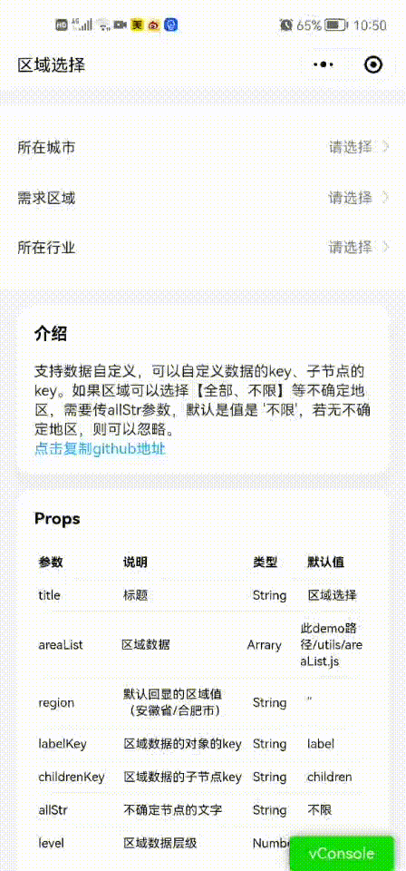

# wj-cascade
微信小程序级联选择，一般的插件都是一个页面把3层都展示出来，会导致如果某一层太长，就显示不全。另外还有ui方面的考虑，做这个插件的初衷，是ui出的的是这种上面点选，下面联动的设计图，直接用市面的插件硬套就不太合适。

## 使用
```
 <!--引用页面的.json文件  -->

 {
  "usingComponents": {
    "region": "../../components/cascade/index"
  }
}
<!-- 引用页面的.wxml文件 -->
<region list="{{areaList}}" bindcascadechange="onAreaChange" region="{{region}}" labelKey="name" childrenKey="children" bindclose="onClose" level="2" title="所在城市"></region>
```

效果:


